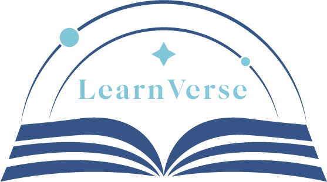

# 🎓 LearnVerse - English E-Learning Platform

<div align="center">
  

  [](https://reactjs.org/)
  [](https://vitejs.dev/)
  [](https://tailwindcss.com/)
  [](https://react-query.tanstack.com/)
  [](https://opensource.org/licenses/MIT)
</div>

## 📖 Overview

LearnVerse is a comprehensive English learning platform designed to provide students and teachers with powerful tools for language education. Built with modern React technologies, it offers interactive learning experiences, comprehensive testing systems, and robust content management capabilities.

## ✨ Features

### 🎯 For Students
- **Online Testing System** - Take level-based English proficiency tests with instant results
- **Vocabulary Tests** - Practice vocabulary across different categories and difficulty levels
- **Interactive Dictionary** - Look up words with definitions, pronunciations, and examples
- **Course Management** - Browse and subscribe to courses with video content
- **Progress Tracking** - Monitor learning progress and test scores
- **Loved Videos** - Save favorite educational videos for quick access
- **Grammar Checker** - Check and improve grammar in real-time
- **Translator** - Translate text between multiple languages

### 👨‍🏫 For Teachers
- **Question Bank Management** - Create and manage test questions by difficulty level
- **Vocabulary Management** - Add and organize vocabulary categories and words
- **Video Management** - Upload and manage course videos
- **Course Creation** - Create comprehensive courses with structured content
- **Student Analytics** - Track student progress and performance

### 🔧 Technical Features
- **Responsive Design** - Optimized for desktop, tablet, and mobile devices
- **Dark Mode Support** - Toggle between light and dark themes
- **Real-time Updates** - Live data synchronization using React Query
- **Role-based Access** - Different interfaces for students, teachers, and admins
- **Secure Authentication** - JWT-based authentication system
- **Modern UI/UX** - Clean, intuitive interface with smooth animations

## 🚀 Quick Start

### Prerequisites
- Node.js (v16 or higher)
- npm or yarn package manager

### Installation

1. **Clone the repository**
   ```bash
   git clone https://github.com/anas-abdullah-eng/learnverse-platform.git
   cd learnverse-platform
   ```

2. **Install dependencies**
   ```bash
   npm install
   # or
   yarn install
   ```

3. **Set up environment variables**
   ```bash
   cp .env.example .env
   ```
   Update the `.env` file with your API endpoints and configuration.

4. **Start the development server**
   ```bash
   npm run dev
   # or
   yarn dev
   ```

5. **Open your browser**
   Navigate to `http://localhost:5173` to see the application.

## 🏗️ Project Structure

```
src/
├── api/                    # API client and endpoints
│   └── courseApi.jsx      # Main API configuration
├── Components/            # Reusable UI components
│   ├── CourseCard/       # Course display components
│   ├── Dictionary/       # Dictionary lookup component
│   ├── LoveSystem/       # Video like/love system
│   ├── Navbar/           # Navigation component
│   ├── OnlineTest/       # Testing system components
│   ├── QuestionBank/     # Question management
│   ├── VideoManager/     # Video management system
│   └── Vocabulary/       # Vocabulary management
├── hooks/                # Custom React hooks
│   ├── useAuth.js        # Authentication hooks
│   ├── useCourses.js     # Course management hooks
│   ├── useDictionary.js  # Dictionary functionality
│   ├── useLove.js        # Like system hooks
│   ├── useOnlineTest.js  # Testing system hooks
│   ├── useTeacher.js     # Teacher-specific hooks
│   ├── useVideo.js       # Video management hooks
│   └── useVocabulary.js  # Vocabulary hooks
├── Pages/                # Page components
│   ├── Dictionary/       # Dictionary page
│   ├── Homepage/         # Landing page
│   ├── OnlineTest/       # Test pages
│   ├── QuestionBank/     # Question management pages
│   ├── VideoManager/     # Video management pages
│   └── Vocabulary/       # Vocabulary pages
└── assets/               # Static assets (images, icons)
```

## 🎨 Design System

### Color Palette
- **Primary**: `#365486` - Deep blue for main actions and branding
- **Secondary**: `#7FC7D9` - Light blue for accents and highlights
- **Light**: `#DCF2F1` - Very light blue for backgrounds
- **Dark**: `rgb(15 23 42)` - Dark slate for text and dark mode

### Typography
- Clean, modern fonts optimized for readability
- Consistent sizing scale using Tailwind CSS utilities
- Proper contrast ratios for accessibility

## 🔌 API Integration

The platform integrates with a comprehensive backend API providing:

- **Authentication**: User login, registration, and role management
- **Course Management**: CRUD operations for courses and content
- **Testing System**: Question banks, test generation, and scoring
- **Vocabulary System**: Word management and testing
- **Video Management**: Upload, organization, and streaming
- **User Analytics**: Progress tracking and performance metrics

## 🛠️ Built With

- **[React](https://reactjs.org/)** - Frontend framework
- **[Vite](https://vitejs.dev/)** - Build tool and development server
- **[Tailwind CSS](https://tailwindcss.com/)** - Utility-first CSS framework
- **[React Query](https://react-query.tanstack.com/)** - Data fetching and state management
- **[React Router](https://reactrouter.com/)** - Client-side routing
- **[Heroicons](https://heroicons.com/)** - Beautiful SVG icons
- **[Swiper.js](https://swiperjs.com/)** - Touch slider component
- **[Axios](https://axios-http.com/)** - HTTP client for API requests

## 📱 Screenshots

<div align="center">
  
  
  
  
</div>

## 📄 License

This project is licensed under the MIT License - see the [LICENSE](LICENSE) file for details.

<div align="center">
  Made with ❤️ for English learners worldwide
</div>
